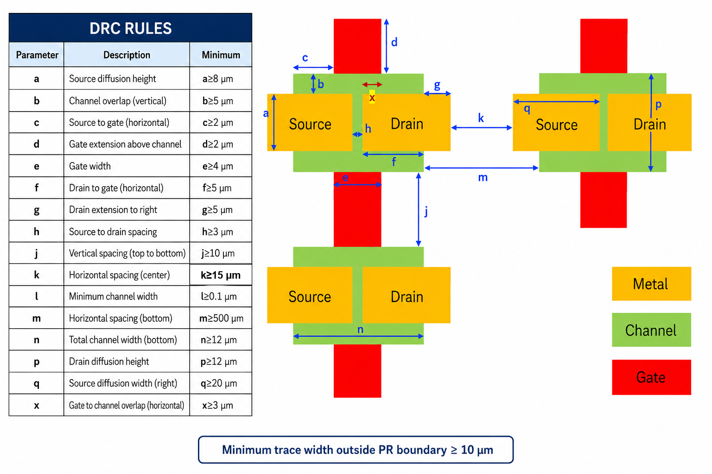

# TFT3D KLayout DRC Update Deck

This directory contains `tft3d_platform_update.drc`, a KLayout DRC runset built
from `/Users/samarthjain/Downloads/DRC Rules Update.pdf`.

The visual reference below is the PDF rule image with the final `k >= 15 um`
update applied:



The rule values are the final chat-update values:

| ID | Description | Minimum |
| --- | --- | --- |
| a | Source diffusion height | 8 um |
| b | Channel overlap, vertical | 5 um |
| c | Source to gate, horizontal | 2 um |
| d | Gate extension above channel | 2 um |
| e | Gate width | 4 um |
| f | Drain to gate, horizontal | 5 um |
| g | Drain extension to right | 5 um |
| h | Source to drain spacing | 3 um |
| j | Vertical spacing, top to bottom | 10 um |
| k | Horizontal spacing, center | 15 um |
| l | Minimum channel width | 0.1 um |
| m | Horizontal spacing, bottom | 500 um |
| n | Total channel width, bottom | 12 um |
| p | Drain diffusion height | 12 um |
| q | Source diffusion width, right | 20 um |
| x | Gate to channel overlap, horizontal | 3 um |

Additional rule: minimum trace width outside the PR boundary is 10 um.

The FlexIC documentation was used only to confirm layer naming and layer-map
consistency. The deck uses the local layermap values: `SEMI` on 3/0, `SD` on
10/0, `GATE` on 11/0, `MT1` on 20/0, `MT2` on 21/0, `RDL` on 54/0, `BOUND` on
150/5, and `CHIPOUTLINE` on 153/5.

KLayout will discover DRC scripts from a `drc` folder under the technology base
path. You can also load the deck manually from KLayout's DRC dialog.

Batch example:

```sh
klayout -b -r pdk/tft3d_platform/libs.tech/klayout/tech/drc/tft3d_platform_update.drc \
  -rd input=/path/to/layout.gds \
  -rd report=/path/to/tft3d_platform_update.lyrdb
```

Assumption: the PDF says `PR boundary`, but the repo/FlexIC layermap has no
layer by that name. The deck uses `BOUND` when present, otherwise
`CHIPOUTLINE`; if neither exists, it checks all trace metal widths against the
10 um requirement.

Source/drain note: GDS data does not encode the words `source`, `drain`,
`top`, `bottom`, `left`, or `right`. The DRC categories keep those names so the
KLayout report matches the supplied figure, while the geometry checks apply to
the corresponding `SD`/`SEMI`/`GATE` features conservatively.
